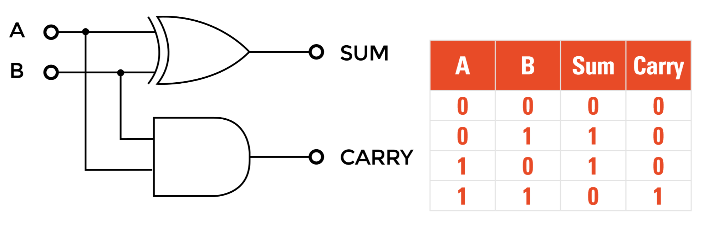

## Introduction

Computers can carry out an awesome amount of mathematics; we all know that. So how come all of this can be performed on a machine that can only add 1 and 1; no subtraction as we know it; no multiplication and no division? The answer is that an electronic adder circuit that just adds 1 + 1 and uses a few tricks of the binary system can, with some help from a little firmware code, carry out any arithmetic we need at an amazing speed. The simple electronic calculator circuit at the heart of this wizardry is known as the Half Adder and is shown, made from just a couple of logic gates (an Exclusive OR gate and an AND gate).

The ‘half’ in its name is because, while it can add 1 plus 0 and even add 0 plus 1 to get the correct answer of 1, as shown in the ‘Sum’ column of the truth table above, if it adds 1 plus 1 in binary, this produces the (decimal) answer of 2, which in binary notation is 10 it can't properly handle the output. A second column is needed in the form of a ‘Carry’ output to hold double the value of the single-digit sum output, producing the answer of 10 (decimal 2). This is fine if we only need to add a single column of binary, but the half adder cannot cope with multi-column numbers where a carry may be produced.

Because the half adder can only add two 1-bit numbers in a single column, it does not usually work alone. However, if the carry output produced by the half adder can be used as one input to another half adder, the two circuits combine to form the full adder, which will now have three inputs and so can add two binary bits in any one column using inputs A and B, plus any ‘carry in’ from a previous column, making multi-column addition possible. 

So, the half adder may not carry out an impressive amount of arithmetic, but as it only takes around 30 nanoseconds to produce its answer, this basic adder could therefore carry out around 100 million similar calculations per second, which is how, when coupled with another half adder and other bits of electronic circuitry, many simple 1+1 additions are made to look like powerful maths, when it’s really simple arithmetic, only at a blazing speed!

## You'll need
* Transistors 8×2N3904 
* Resistors 4× 4.7kΩ (4K7) for R1, R10, R11 & R12 8× 6.8kΩ (6K8)  for all other resistors 
* Switches  2× Mini push to close 
* 2× 5V LEDs  1× Kingbright L-53GD (5mm green) and 1× Kingbright L-53ID (5mm red) are ideal and need no limiting resistors 
* Breadboard and wire links 
* 5V Power supply (only 2mA current needed)

## Author
**Eric Coates**, BSc (Hons) MA, has lectured on electronics in technical colleges and acted as examiner and moderator for several UK technical educational boards. He is the founder and CEO of [learnabout-electronics.com](http://www.learnabout-electronics.org/{:target="_blank"}).

