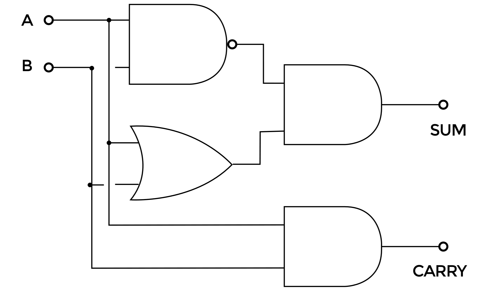

## Exclusive OR

 The most complex part of the half adder is an Exclusive OR (XOR) gate, which produces an output of logic 1 when its two inputs are different (01 or 10), but an output of 0 when the two inputs are the same (00 or 11). XOR gates comprise rather more electronics than the other more standard gates, which makes them slower, therefore less popular and more expensive than the other standard gates. However, the Exclusive OR logic function can be, and very often is carried out by a combination of more regular logic gates, where the XOR gate is replaced by a combination of AND, OR and NAND gates, and this  the approach we shall use in our transistor/resistor version of the half adder.
 
 
 
So why, when logic gates are readily available in integrated circuit form, and you can easily simulate their operation on a computer screen, would you want to build them from basic electronic components such as resistors and transistors? Well, these days when the Internet of Things is becoming more and more important, the skill of combining computers such as the Raspberry Pi or Arduino with external electronic circuits and devices is becoming vital. It’s one thing to move things about on a computer or smartphone display, but different skills are needed to drive output devices and make things change in the real world. Therefore it’s more vital than ever to understand the operation of electronic circuits at component level, and to develop the knowledge and skills needed for constructing working circuits such as the half adder.
