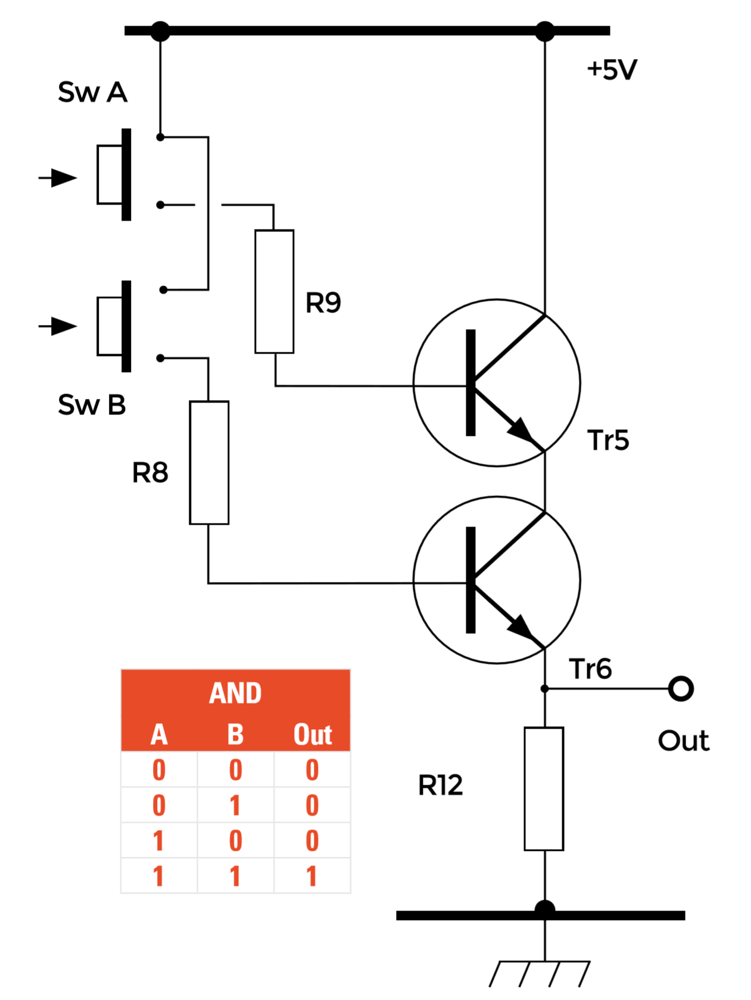

## The AND Gate

Our half adder circuit will contain two AND gates, both working to produce the truth table in the below image.

Notice in this circuit that the two transistors Tr5 and Tr6 are effectively connected in series; that is, the same current will be flowing through Tr5 (collector to emitter) and through Tr6 (collector to emitter). Therefore, for this current to develop a voltage across R12, both transistors must be conducting. All the transistors in the whole of the half adder circuit are operated in switch mode; that is, they will either be switched on by a large enough current flowing into their base connection to cause the transistor to conduct heavily, or switched off by removing the base current and therefore preventing any collector/emitter current. The base current for Tr5 and Tr6 depends on the values of R9 and R8, which are both 6.8 kΩ, and the switches Sw A and Sw B are used to simply connect R9 and R8 to the +5 V supply. So, when both transistors are switched on, the current through Tr5 and Tr6 will develop an output voltage across R12 (4.7 kΩ) equal to the supply voltage, minus a small voltage drop due to the voltages across the PN junctions in Tr5 and Tr6. As shown in the previous step, one AND circuit will be used to drive the 'Sum' output of the half adder and the other AND circuit will drive the 'Carry' output.
