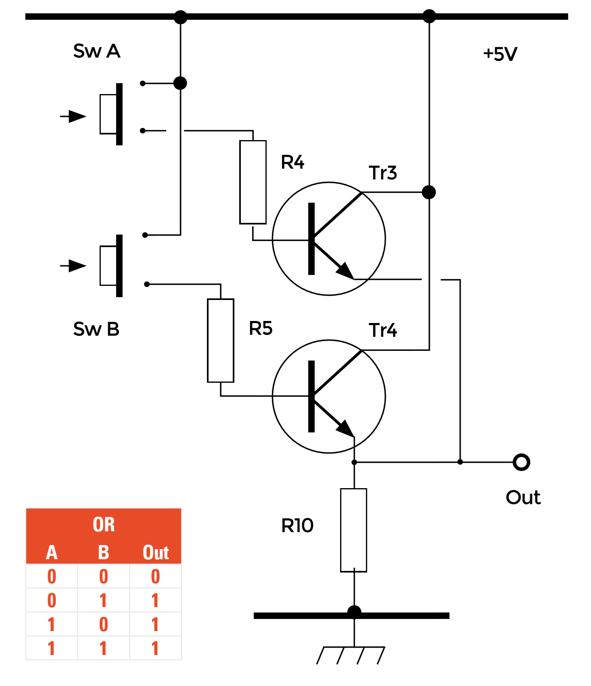

## The OR Gate

As in the AND gate, the transistors here are being used as electronic switches and are activated by the currents flowing into their bases from Sw A and Sw B via the 6.8 kΩ resistors R4 and R5 (Figure 5). However, in this circuit the transistors Tr3 and Tr4 are connected in parallel, with the collector of Tr3 connected directly to the collector of Tr4 and the emitters of both transistors also connected together. Therefore if either Tr3 or Tr4 is made to conduct, a voltage almost equal to the +5 V supply will be developed across the output resistor R10. This therefore produces what we shall call logic 1 at the output if Tr3, Tr4 or both transistors are made to conduct, fulfilling the requirements of the OR truth table and in the total half adder circuit, driving one of the inputs of the Sum AND gate as part of Step 2’s XOR function.

