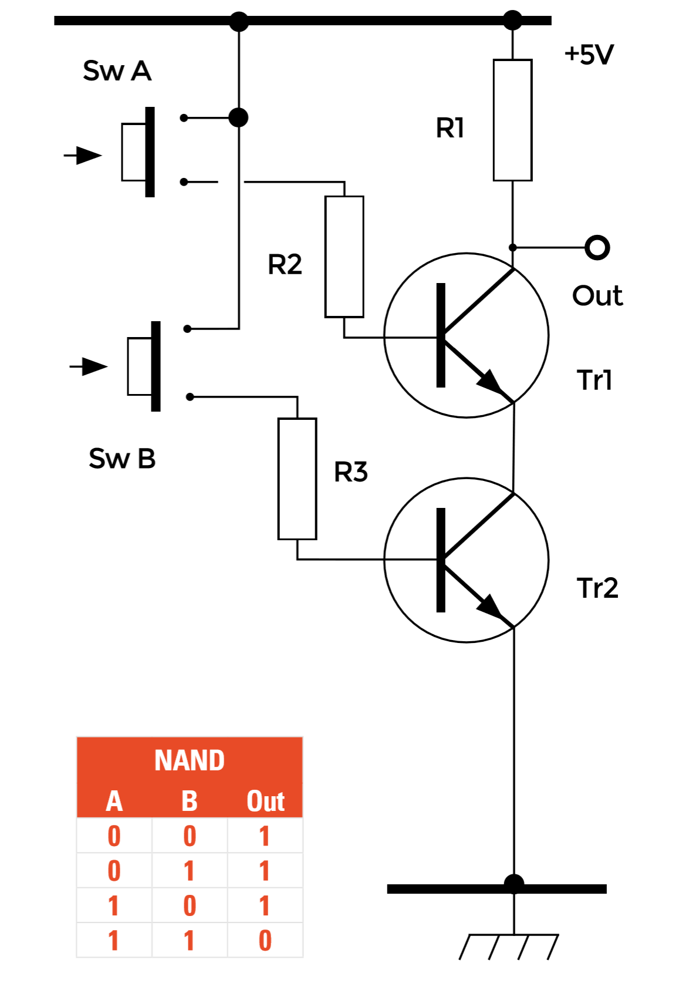

## The NAND Gate

Comparing the truth tables for the NAND gate in the image below and the AND gate, it can be seen that the output columns of each table are the opposites of each other. This tells us that the circuit for the NAND gate will be similar to that of the AND gate, but the outputs will have opposite logic values. Compare the circuits in the AND gate and below to see how this is done. The 4.7 kΩ output resistor R12 connected from Tr6 emitter to ground in the AND gate is simply moved to become R1 below. Now if both transistors below are made to conduct at the same time, the voltage at the bottom of R1 will be almost 0 V so producing logic 0 at the output; if either one or both transistors are switched off, however, the current path from R1 to ground will be interrupted and the output terminal will remain at logic 1, fulfilling the logic requirements of a NAND gate. 

