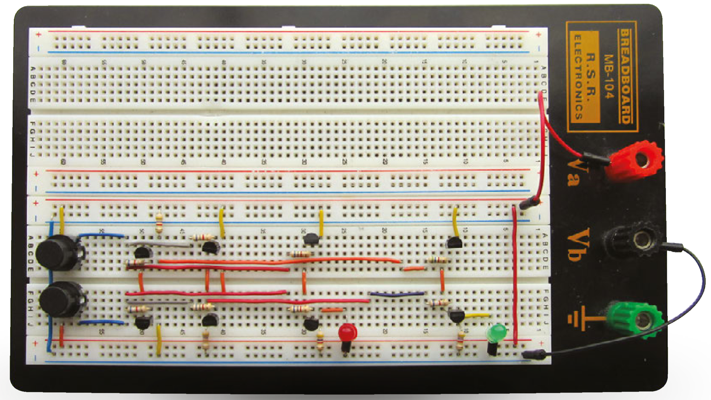

## Bringing it all together

--- collapse ---
---
title: Building tips
---
Before you build this circuit, it’s a good idea to build each of the individual gate circuits separately, so you can test each circuit to make sure they give the results shown in their respective truth tables. If you fit the two input switches to the breadboard first, you can use these to test each of the gate circuits. You’ll also need to include the two output LEDs. Building these three logic gate circuits separately will enable you to find the best layout for each gate circuit and help you to understand how each gate circuit works before attempting the complete half adder. 
--- /collapse ---

This illustrates how two AND functions (shaded green), as well as the OR function (shaded blue) and NAND (shaded pink) logic functions needed for a half adder can be interconnected to drive two 5 V LEDs representing the Sum and Carry outputs. The LEDs used in this project are designed for +5 V supply circuits and have built-in current-limiting resistors so extra current-limiting resistors are not needed – unless you decide to use standard LEDs, in which case you will need to fit an appropriate current-limiting resistor in series with the LED. You can follow this schematic to make a working half adder circuit depending on the breadboard and wire links you have available. The half adder may not be as familiar as other more recognisable parts of a computer system such as disk drives, sound cards and touchscreens, but computers can work quite well without these, as proved by devices such as the Raspberry Pi and Arduino. However, no computer – not the Raspberry Pi, not the Arduino, nor even your pocket calculator – can work without the half adder, one of the unsung heroes of computing! If studying adders in this article has inspired you to find out more about them, and how binary arithmetic really works to give the basic adders described here the power to carry out some awesome arithmetic, take a look at <https://hsmag.cc/qnFyCp>, where millions of people dedicated to learning about electronics go to study these fascinating combinational logic circuits essential to computing, as well as many more digital and analogue topics. 

This tutorial first appeared in HackSpace magazine issue 2. You can read about hacking and making every month at [hsmag.cc](https://hsmag.cc){:target="_blank"}